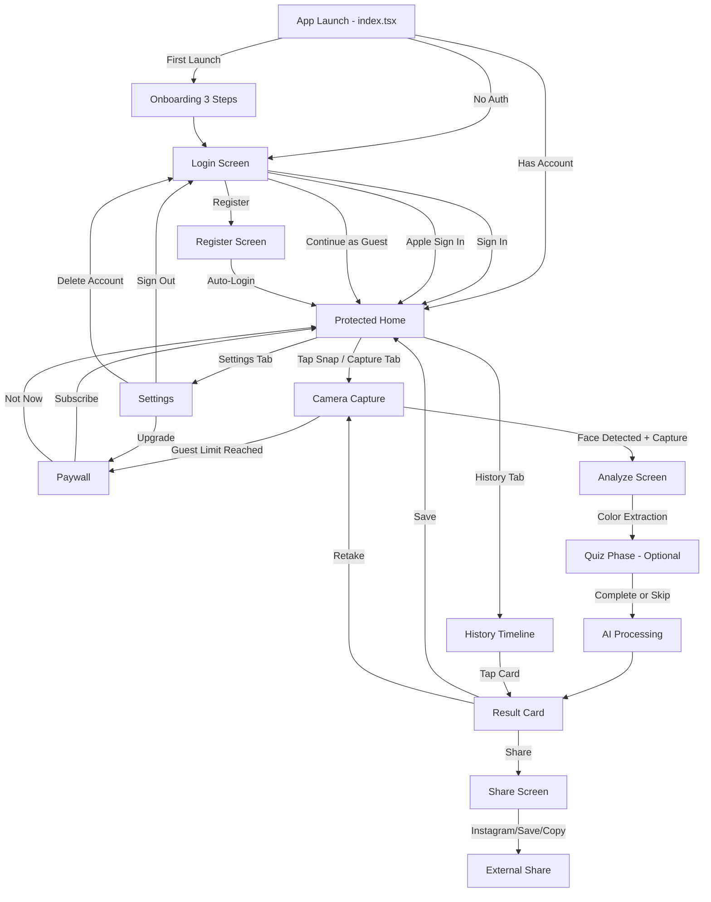

# VibeSnap — Master Specification

> Snap a selfie, discover your vibe

Generated: 2026-02-14T12:42:23.589721+00:00 | Pipeline v1.0.0

## 1. App Overview

**Name:** VibeSnap
**Tagline:** Snap a selfie, discover your vibe
**Description:** VibeSnap analyzes your selfie using on-device color extraction and facial expression mapping to generate a unique vibe card with personality traits, mood energy score, and aesthetic archetype. Users get instant shareable results styled as premium social cards optimized for Instagram Stories and TikTok. The app combines the virality of photo-based personality quizzes with a beautiful, ad-free experience.
**Target Audience:** Gen Z and young millennials (16-28) who love personality quizzes, selfie culture, and sharing aesthetic content on social media
**Differentiator:** Unlike competitors that fail at face detection or require lengthy quizzes, VibeSnap uses color-based analysis (no complex facial recognition needed) combined with a quick micro-quiz to deliver instant, visually stunning vibe cards. The focus is on shareability and aesthetic output rather than clinical mood tracking.
**Feasibility:** moderate (10 days)
**Confidence:** 82%

## 2. Tech Stack (Fixed)

- **Mobile:** Expo SDK 54 + React Native 0.81 + NativeWind v4 + Expo Router v6
- **Backend:** Go-Fiber v2 + GORM + PostgreSQL
- **Auth:** JWT + Sign in with Apple
- **Payments:** RevenueCat
- **Deployment:** Coolify PaaS
- **Ci Cd:** EAS Build + Fastlane

## 3. Core Features

1. Selfie capture with guided framing overlay for reliable face positioning
2. On-device color palette extraction from photo (skin tone, clothing, background colors)
3. AI vibe analysis combining color data with optional 3-question micro-quiz for personality depth
4. Shareable vibe card with gradient background, vibe name, energy score, and trait badges
5. Vibe history timeline showing how your energy shifts over days and weeks
6. Daily vibe check notification with streak counter and loss-aversion messaging
7. Guest mode with 3 free vibe reads before signup prompt

## 4. Market Research

**Market Size:** TAM estimated at 50-100M users interested in mood/personality apps globally. SAM for photo-based vibe checking estimated at 5-10M early adopters. Top apps in adjacent spaces (Mood AI, The Personality Types) have 12,000-22,000+ reviews indicating strong user engagement. The niche is emerging with AI photo analysis capabilities.
**Sentiment:** neutral (3.2/5)
**Competitors:** 6
**Trends:** AI-powered mood and personality analysis becoming mainstream, Photo-based vibe checking apps emerging (VibeCheck, Aurascope, Vibemax), Lock screen integration for real-time mood sharing

### Pain Points

- **Face detection/recognition failures prevent users from even using the app** (severity: 9/10, freq: 7/10)
- **Limited customization options for mood avatars and mood types** (severity: 6/10, freq: 6/10)
- **App crashes and performance issues making apps unusable** (severity: 8/10, freq: 5/10)
- **Subscription cancellation problems and hidden charges** (severity: 9/10, freq: 4/10)
- **Excessive popups and ads interrupting app usage** (severity: 7/10, freq: 5/10)

### Competitors

| App | Rating | Reviews | Price | Strengths | Weaknesses |
|-----|--------|---------|-------|-----------|------------|
| Vibe - Make New Friends | 3.9 | 9,257 | free | Social friend-making features, Snapchat integration | Face detection failures, Age matching issues |
| Vibes - BFF mood tracker | 4.6 | 2,339 | free | Lock screen integration, Real-time mood sharing | Limited avatar customization, Crashing issues |
| Mood AI - Daily journal | 4.8 | 22,551 | freemium | AI integration, Large user base | Slow performance, Limited customization |
| Pulse: Emotional resonance | 4.0 | 2,579 | freemium | Unique fingerprint approach, Novel concept | Subscription cancellation issues, Perceived as fake/AI |
| The Personality Types | 4.8 | 12,765 | free | Comprehensive MBTI database, Celebrity matching | Not photo-based, Reference app not interactive mood tracker |
| VibeCheck: Test Your Photos | 0.0 | 0 | free | Direct photo feedback, Dating profile optimization | Limited reviews available, Narrow use case |

## 5. Design System

**Style:** Neo-Aesthetic Dark with AI Gradient Haze and Glassmorphism

### Colors

| Token | Hex | Usage |
|-------|-----|-------|
| primary | `#8B5CF6` | Primary brand color, CTA buttons, active states, gradient starts |
| secondary | `#F472B6` | Secondary accent, gradient ends, highlight elements, energy indicators |
| accent | `#22D3EE` | Energy scores, notification badges, success states, vibe streaks |
| surface | `#18181B` | Card backgrounds, elevated surfaces, glassmorphism base layer |
| surface_elevated | `#27272A` | Modal backgrounds, bottom sheets, higher elevation cards |
| background | `#09090B` | App background, OLED deep dark, primary canvas |
| text_primary | `#FAFAFA` | Primary text, headings, important content on dark backgrounds |
| text_secondary | `#A1A1AA` | Secondary text, descriptions, timestamps, less prominent labels |
| text_muted | `#71717A` | Placeholder text, disabled states, hint text |
| border | `#3F3F46` | Subtle borders, dividers, input outlines in dark mode |
| border_glow | `#A855F7` | Glowing borders for premium cards, active camera frame |
| success | `#4ADE80` | Positive vibe traits, completion states, streak achievements |
| warning | `#FBBF24` | Moderate energy levels, caution states, limited free uses |
| overlay | `#09090B` | Modal overlays, image overlays with 60-80% opacity |
| glass_tint | `#FFFFFF` | Glassmorphism tint layer at 8-12% opacity for frosted effect |

### Dark Mode Overrides

| Token | Hex | Usage |
|-------|-----|-------|
| dm_background | `#09090B` | OLED deep black background for maximum contrast and battery efficiency |
| dm_surface | `#18181B` | Elevated card surfaces with subtle transparency for glassmorphism |
| dm_gradient_start | `#7C3AED` | Deep purple for gradient starts in dark mode, slightly darker than light mode |
| dm_gradient_end | `#EC4899` | Deep pink for gradient ends in dark mode |
| dm_text | `#FAFAFA` | High contrast white text for dark backgrounds, WCAG AA compliant |

### Typography

- **display:** 36px bold, line-height: 1.1
- **heading1:** 28px bold, line-height: 1.2
- **heading2:** 22px semibold, line-height: 1.3
- **heading3:** 18px semibold, line-height: 1.4
- **body:** 16px normal, line-height: 1.5
- **body_small:** 14px normal, line-height: 1.5
- **caption:** 12px medium, line-height: 1.4
- **micro:** 10px medium, line-height: 1.2
- **energy_score:** 48px bold, line-height: 1.0
- **vibe_name:** 32px bold, line-height: 1.1

### Component Styles

- **vibe_card:** radius=24px, padding=`p-6`, shadow=`shadow-2xl` Glassmorphism card with gradient haze background, 40% surface opacity, backdrop-blur-xl, 1px border with glow effect for premium
- **button_primary:** radius=16px, padding=`px-6 py-4`, shadow=`shadow-lg` Min 44px height, gradient background primary to secondary, haptic feedback on press, scale-95 active state
- **button_secondary:** radius=16px, padding=`px-6 py-4`, shadow=`shadow-md` Glass background with border, transparent fill, 1.5px border, used for skip/guest actions
- **trait_badge:** radius=20px, padding=`px-4 py-2`, shadow=`` Pill-shaped badge with gradient or solid accent color, small text, arranged in flex-wrap row
- **energy_ring:** radius=9999px, padding=`p-4`, shadow=`shadow-xl` Circular progress indicator, gradient stroke, centered score number, animated fill on reveal
- **camera_frame:** radius=32px, padding=`p-2`, shadow=`` Oval guide overlay with animated dashed border, 2px stroke, glow pulse animation for positioning
- **modal_sheet:** radius=28px, padding=`p-6`, shadow=`shadow-2xl` Bottom sheet with glassmorphism, rounded top corners only, drag handle at top
- **history_card:** radius=16px, padding=`p-4`, shadow=`shadow-sm` Bento grid item, compact vibe preview with mini gradient, date, and mini energy score
- **input_field:** radius=12px, padding=`px-4 py-3`, shadow=`` Glass background, subtle border, 44px min height, focus ring with accent glow
- **toast_notification:** radius=12px, padding=`px-4 py-3`, shadow=`shadow-lg` Floating toast with glass effect, icon + text, auto-dismiss, slide-in from top animation
- **streak_badge:** radius=12px, padding=`px-3 py-1`, shadow=`` Small fire icon with number, gradient background, displayed in header for daily streaks
- **quiz_option:** radius=16px, padding=`p-4`, shadow=`shadow-sm` Selectable card with glass effect, selected state shows gradient border glow, 44px min touch target

### Design Notes

- AI Gradient Haze: Use animated gradient backgrounds on vibe cards with blur overlay - creates dreamy, ethereal aesthetic popular on TikTok
- OLED Deep Dark: True black (#09090B) background saves battery on OLED screens and makes gradients pop dramatically
- Glassmorphism: All cards use backdrop-blur-xl with 8-12% white tint overlay, creating depth without heavy shadows
- Haptic-Visual Sync: Button presses trigger haptic feedback synchronized with scale animations (scale-95 on press, scale-pop on release)
- Bento Grid: Vibe history uses asymmetric 2-column grid layout with varying card heights for visual interest
- All touch targets are minimum 44x44px for accessibility compliance
- Energy score uses animated circular progress with gradient stroke - reveals with satisfying animation on vibe completion
- Camera framing overlay uses pulsing glow animation to guide face positioning without complex AR
- Trait badges use gradient fills matching the vibe card's extracted color palette for personalization
- Streak counter uses loss-aversion messaging with fire icon and warm gradient to drive daily engagement
- Premium cards feature subtle animated border glow to differentiate from free tier
- Shareable vibe cards are pre-formatted for Instagram Stories (9:16) and TikTok with proper safe zones

## 6. UX Architecture

**Navigation:** custom-tab-bar

### Tab Bar

| Label | Icon | Route |
|-------|------|-------|
| Home | home | /(protected)/home |
| Snap | camera | /(protected)/capture |
| History | time | /(protected)/history |
| Settings | settings | /(protected)/settings |

### Screens

#### index
- **Route:** `app/index.tsx`
- **Description:** Smart router: checks AsyncStorage for onboarding completion, then auth state. Redirects to /onboarding if first launch, /(auth)/login if unauthenticated and no guest session, or /(protected)/home if authenticated or guest.
- **Components:** ActivityIndicator, Full-screen splash with VibeSnap logo

#### onboarding
- **Route:** `app/onboarding.tsx`
- **Description:** 3-step horizontal pager. Step 1: 'Snap Your Vibe' — animated selfie frame illustration with tagline 'One selfie reveals your energy'. Step 2: 'AI-Powered Insights' — color palette morphing animation with tagline 'Colors, traits, and energy — decoded in seconds'. Step 3: 'Share Your Vibe' — mock vibe card with tagline 'Flex your energy on Instagram and TikTok'. Bottom: dot indicators + 'Get Started' button on step 3 (calls continueAsGuest or navigates to auth). Skip button top-right on steps 1-2.
- **Components:** FlatList horizontal pagingEnabled, Animated.View for illustrations, DotIndicator (3 dots), GradientButton 'Get Started', Pressable 'Skip'

#### login
- **Route:** `app/(auth)/login.tsx`
- **Description:** Auth screen with VibeSnap logo at top (48x48), tagline 'Discover your energy'. Email input (placeholder: 'your@email.com'), password input with show/hide toggle. 'Sign In' gradient button (#7C3AED → #0EA5E9). 'Forgot Password?' link below. Divider '— or —'. AppleSignInButton (dark, rounded). 'Don't have an account? Sign Up' link. 'Continue as Guest' subtle text link at bottom. Haptic feedback on all buttons.
- **Components:** Logo, TextInput email, TextInput password with eye toggle, GradientButton 'Sign In', AppleSignInButton, Pressable 'Sign Up' link, Pressable 'Continue as Guest'
- **API Calls:** POST /api/auth/login, POST /api/auth/apple

#### register
- **Route:** `app/(auth)/register.tsx`
- **Description:** Registration screen. VibeSnap logo, 'Create Your Vibe Profile' heading. Email input, password input (min 8 chars, show strength indicator), confirm password input. 'Create Account' gradient button. AppleSignInButton. 'Already have an account? Sign In' link. On success: auto-login + navigate to /(protected)/home with success haptic.
- **Components:** Logo, TextInput email, TextInput password with strength bar, TextInput confirm password, GradientButton 'Create Account', AppleSignInButton, Pressable 'Sign In' link
- **API Calls:** POST /api/auth/register

#### protected-layout
- **Route:** `app/(protected)/_layout.tsx`
- **Description:** Protected layout using Slot (NOT Stack/Tabs). Checks isAuthenticated or isGuest from AuthContext — if neither, redirect to /(auth)/login. Renders Slot for child content + custom tab bar at bottom. Tab bar: 4 items (Home, Capture, History, Settings). Tab bar background: #000000 with 0.95 opacity blur. Active tab: #7C3AED icon + label. Inactive: #6B7280. Capture tab is center-emphasized with larger icon (28px vs 24px).
- **Components:** Slot, CustomTabBar with 4 Pressable items, SafeAreaView bottom padding

#### home
- **Route:** `app/(protected)/home.tsx`
- **Description:** Main dashboard. Top: greeting 'Hey {name}! 👋' or 'Hey there! 👋' for guests. Streak banner: flame icon + '{N}-day streak — keep it alive!' in amber gradient card (#F59E0B → #EF4444) or 'Start your streak today' if no streak. Below: latest vibe card (if exists) — full gradient background with vibe name, energy score circle, trait badges. If no vibes yet: empty state illustration + 'Take Your First Vibe Snap' CTA button. Guest users see UsageBadge '{N}/3 free vibes remaining' below streak. Bottom section: 'Your Vibe Trend' mini chart showing last 7 days energy scores as a sparkline. Pull-to-refresh enabled.
- **Components:** SafeAreaView, ScrollView refreshControl, GreetingHeader, StreakBanner (GradientCard amber), LatestVibeCard or EmptyState, UsageBadge (guests only), VibeTrendSparkline, GradientButton 'Snap Your Vibe'
- **API Calls:** GET /api/vibes/latest, GET /api/vibes/streak, GET /api/vibes/trend?days=7

#### capture
- **Route:** `app/(protected)/capture.tsx`
- **Description:** Selfie capture screen. Full-screen camera preview (expo-camera, front-facing). Overlay: rounded-rectangle face guide frame (dashed border, #7C3AED at 40% opacity, 260x340px centered). Text above frame: 'Center your face in the frame'. Face detection indicator: green dot when face detected, red dot when not. Bottom controls: circular capture button (64px, white border 3px, gradient fill #7C3AED → #0EA5E9) centered. Flash toggle top-left (Ionicons 'flash' / 'flash-off'). Camera flip top-right (Ionicons 'camera-reverse'). On capture: haptic impact medium, brief white flash animation, navigate to /analyze with photo URI. Guest check: if guestUsageCount >= 3, show soft paywall modal instead of capturing.
- **Components:** CameraView (expo-camera), FaceGuideOverlay (dashed rounded rect), FaceDetectionIndicator (green/red dot), Pressable capture button with gradient, Pressable flash toggle, Pressable camera flip, GuestLimitModal

#### analyze
- **Route:** `app/(protected)/analyze.tsx`
- **Description:** Analysis loading + optional quiz screen. Two phases: Phase 1 — 'Extracting your colors...' with animated color dots appearing one by one from the selfie (show 6 extracted hex swatches morphing in). Progress bar 0-40%. Phase 2 — 3-question micro-quiz (optional, can skip). Q1: 'Right now I feel...' → 4 emoji options (😊 Energized, 😌 Calm, 😤 Fired Up, 🥱 Low-Key). Q2: 'My ideal Friday night:' → 4 text options (Party with friends, Cozy night in, Creative project, Adventure outdoors). Q3: 'Pick a word:' → 4 options (Bold, Gentle, Wild, Mysterious). Each answer triggers haptic light + color pulse animation. 'Skip Quiz' link at bottom. After quiz or skip: progress bar fills to 100% with 'Generating your vibe...' + streaming text animation. Then navigate to /result with vibeId.
- **Components:** Animated color extraction visualization, ProgressBar (Animated.View), QuizCard with 4 option Pressables per question, Pressable 'Skip Quiz', StreamingText 'Generating your vibe...'
- **API Calls:** POST /api/vibes/analyze (multipart: photo + quiz_answers)

#### result
- **Route:** `app/(protected)/result.tsx`
- **Description:** Vibe result card — the hero screen. Full-screen gradient background (dynamic based on vibe: warm vibes = #EF4444→#F59E0B, cool vibes = #0EA5E9→#7C3AED, balanced = #22C55E→#0EA5E9, intense = #7C3AED→#EF4444). Vibe card centered: vibe name large (e.g. 'Solar Flare', 'Ocean Zen', 'Electric Spark') in 32px bold white. Energy score: circular progress ring (120px) with score 0-100 and label. Trait badges: 3-4 pill-shaped badges (e.g. 'Creative', 'Adventurous', 'Warm') in frosted glass style. Color palette strip: 6 extracted colors as circles. Quote: AI-generated one-liner about the vibe. Bottom actions: 'Share Vibe' primary button (opens share sheet with rendered card image), 'Save to History' secondary, 'Retake' text link. Confetti animation on first load (react-native-reanimated). Haptic success on load. Guest users: increment usage count, show 'N/3 free vibes used' toast.
- **Components:** LinearGradient full-screen, VibeNameText 32px bold, EnergyScoreRing (Animated circular progress), TraitBadges (frosted glass pills), ColorPaletteStrip (6 circles), VibeQuoteText italic, GradientButton 'Share Vibe', Pressable 'Save to History', Pressable 'Retake', ConfettiAnimation
- **API Calls:** GET /api/vibes/{id}, POST /api/vibes/{id}/save

#### history
- **Route:** `app/(protected)/history.tsx`
- **Description:** Vibe history timeline. Top: 'Your Vibe Journey' heading + current streak badge. Filter chips: 'Week' | 'Month' | 'All' (default: Week). Timeline view: vertical list of vibe cards, each showing date, mini gradient thumbnail, vibe name, energy score, and top trait. Cards are Pressable — tap to view full result. Energy trend chart: line graph showing energy scores over selected period (react-native-svg or simple Animated.View bars). Empty state for new users: illustration + 'Your vibe story starts with a snap' + CTA button. Guests see max 3 entries with blur overlay on the rest + 'Sign up to unlock your full vibe history' banner.
- **Components:** SafeAreaView, ScrollView, StreakBadge, FilterChips (Week/Month/All), FlatList of VibeHistoryCard, EnergyTrendChart, EmptyState illustration, GuestBlurOverlay + SignUpBanner
- **API Calls:** GET /api/vibes/history?period=week|month|all, GET /api/vibes/streak

#### settings
- **Route:** `app/(protected)/settings.tsx`
- **Description:** Settings screen. Profile section: avatar (from latest selfie or default), name, email. 'Edit Profile' row. Sections with grouped rows: [Subscription] 'VibeSnap Pro' — shows current plan or 'Upgrade' with sparkle icon. [Preferences] 'Daily Vibe Reminder' toggle (default ON, 9:00 AM), 'Notification Time' picker. [Privacy] 'Privacy Hub' — shows data collected (selfies processed on-device, quiz answers stored, no biometric data sold). 'Delete My Data' — confirmation modal + haptic warning. [Account] 'Restore Purchases', 'Sign Out', 'Delete Account' (red, with password confirmation modal). [About] 'Privacy Policy', 'Terms of Service', 'Rate VibeSnap', 'Version 1.0.0'. Guest users see 'Create Account' CTA instead of profile section.
- **Components:** SafeAreaView, ScrollView, ProfileSection (avatar + name + email), SettingsRow with chevron, Switch for toggles, Pressable rows, DeleteAccountModal with password input, DeleteDataModal, GuestCTABanner
- **API Calls:** GET /api/user/profile, PUT /api/user/profile, POST /api/auth/logout, DELETE /api/auth/account, POST /api/user/delete-data

#### paywall
- **Route:** `app/(protected)/paywall.tsx`
- **Description:** Paywall screen triggered at guest limit (3 vibes) or from settings. Hero: gradient background (#7C3AED → #0EA5E9) + 'Unlock Unlimited Vibes' heading. Benefit list with checkmark icons: 'Unlimited vibe reads', 'Full vibe history & trends', 'Exclusive vibe types', 'Priority AI analysis', 'No ads ever'. Plan cards: Weekly $2.99/week (no highlight), Monthly $4.99/month ('Most Popular' badge, highlighted border), Annual $39.99/year ('Best Value' badge, shows $3.33/month). 'Start Free Trial' gradient button (if eligible) or 'Subscribe' button. 'Restore Purchases' link below. 'Not now' dismiss link at bottom. Haptic on plan selection.
- **Components:** LinearGradient header, BenefitList with Ionicons checkmarks, PlanCard x3 (Pressable, highlighted border for selected), GradientButton 'Start Free Trial' / 'Subscribe', Pressable 'Restore Purchases', Pressable 'Not now'
- **API Calls:** RevenueCat getOfferings(), RevenueCat purchasePackage()

#### share
- **Route:** `app/(protected)/share.tsx`
- **Description:** Share preview screen. Shows the rendered vibe card as it will appear when shared. Card is captured as image using react-native-view-shot. Preview of the card with VibeSnap watermark (small logo + 'vibeSnap' text bottom-right). Share options: 'Instagram Stories' (opens IG with sticker), 'Save to Photos', 'Copy Link', 'More...' (native share sheet). Referral code shown: 'Share your code: VIBE-{userCode} — friends get 1 extra free vibe'. Haptic on share success.
- **Components:** ViewShot wrapper, VibeCardPreview (rendered result card), WatermarkOverlay, ShareOptionButton x4 (Instagram, Save, Copy, More), ReferralCodeBanner
- **API Calls:** POST /api/vibes/{id}/share-link, GET /api/user/referral-code

### User Flows

- **onboarding:** index → onboarding → login
  First launch: index checks AsyncStorage hasSeenOnboarding=false → shows 3-step onboarding → user taps 'Get Started' → login screen. Can skip to guest mode from login.
- **guest-flow:** login → home → capture → analyze → result → paywall
  Guest taps 'Continue as Guest' on login → home (empty state) → capture selfie → analyze → result (usage count incremented). After 3rd vibe, capture redirects to paywall instead of camera.
- **main-usage:** home → capture → analyze → result → share
  Authenticated user: home shows latest vibe + streak → tap 'Snap Your Vibe' or Capture tab → camera with face guide → take selfie → color extraction + optional quiz → result card with confetti → share to social.
- **history-review:** history → result
  User taps History tab → views timeline of past vibes → taps a card → views full result with option to re-share.
- **settings-management:** settings → paywall
  User taps Settings tab → manage profile, notifications, privacy, subscription. 'Upgrade' row navigates to paywall. 'Delete Account' triggers confirmation modal then logout.
- **daily-notification:** home → capture → analyze → result
  Push notification: 'Your daily vibe check is waiting! 🔥 Don't break your {N}-day streak!' → opens app to home → user taps capture → completes flow → streak incremented.

### Flow Diagram

## 7. Backend Specification

### GORM Models

**User**
  {'ID': 'uuid;default:gen_random_uuid();primaryKey', 'Email': 'string;uniqueIndex;not null', 'PasswordHash': 'string', 'AppleUserID': 'string;uniqueIndex', 'DisplayName': 'string;size:50', 'AvatarURL': 'string', 'IsPremium': 'bool;default:false', 'StreakCount': 'int;default:0', 'LongestStreak': 'int;default:0', 'LastVibeAt': '*time.Time', 'TotalVibes': 'int;default:0', 'CreatedAt': 'time.Time;autoCreateTime', 'UpdatedAt': 'time.Time;autoUpdateTime', 'DeletedAt': 'gorm.DeletedAt;index'}

**RefreshToken**
  {'ID': 'uuid;default:gen_random_uuid();primaryKey', 'UserID': 'uuid;index;not null', 'Token': 'string;uniqueIndex;not null', 'ExpiresAt': 'time.Time;not null', 'CreatedAt': 'time.Time;autoCreateTime', 'DeletedAt': 'gorm.DeletedAt;index'}

**VibeAnalysis**
  {'ID': 'uuid;default:gen_random_uuid();primaryKey', 'UserID': 'uuid;index;not null', 'VibeName': 'string;size:60;not null', 'VibeEmoji': 'string;size:10', 'EnergyScore': 'int;not null;check:energy_score >= 0 AND energy_score <= 100', 'DominantColors': 'jsonb;not null', 'TraitBadges': 'jsonb;not null', 'GradientStart': 'string;size:7;not null', 'GradientEnd': 'string;size:7;not null', 'QuizAnswers': 'jsonb', 'VibeDescription': 'string;size:280', 'SelfieURL': 'string', 'ShareToken': 'string;uniqueIndex;size:12', 'IsPublic': 'bool;default:true', 'CreatedAt': 'time.Time;autoCreateTime', 'DeletedAt': 'gorm.DeletedAt;index'}

**DailyStreak**
  {'ID': 'uuid;default:gen_random_uuid();primaryKey', 'UserID': 'uuid;not null', 'Date': 'date;not null', 'VibeAnalysisID': 'uuid;not null', 'CreatedAt': 'time.Time;autoCreateTime'}

**Subscription**
  {'ID': 'uuid;default:gen_random_uuid();primaryKey', 'UserID': 'uuid;index;not null', 'RevenueCatID': 'string;uniqueIndex', 'ProductID': 'string;not null', 'Status': 'string;not null;default:active', 'ExpiresAt': 'time.Time', 'CreatedAt': 'time.Time;autoCreateTime', 'UpdatedAt': 'time.Time;autoUpdateTime', 'DeletedAt': 'gorm.DeletedAt;index'}

**Report**
  {'ID': 'uuid;default:gen_random_uuid();primaryKey', 'ReporterID': 'uuid;not null', 'ReportedUserID': 'uuid', 'ReportedVibeID': 'uuid', 'Reason': 'string;not null', 'Details': 'string;size:500', 'Status': 'string;default:pending', 'AdminNote': 'string', 'ResolvedAt': '*time.Time', 'CreatedAt': 'time.Time;autoCreateTime', 'DeletedAt': 'gorm.DeletedAt;index'}

**Block**
  {'ID': 'uuid;default:gen_random_uuid();primaryKey', 'BlockerID': 'uuid;not null', 'BlockedID': 'uuid;not null', 'CreatedAt': 'time.Time;autoCreateTime', 'DeletedAt': 'gorm.DeletedAt;index'}

**PushToken**
  {'ID': 'uuid;default:gen_random_uuid();primaryKey', 'UserID': 'uuid;index;not null', 'Token': 'string;not null', 'Platform': 'string;size:10;not null', 'CreatedAt': 'time.Time;autoCreateTime', 'UpdatedAt': 'time.Time;autoUpdateTime'}

### API Endpoints

| Method | Path | Auth | Description |
|--------|------|------|-------------|
| GET | `/api/health` | No | Health check — returns server status, DB connectivity, uptime, and version string. Response: {"status": "ok", "database": "connected", "uptime": "2h30m", "version": "1.0.0"} |
| POST | `/api/auth/register` | No | Register with email and password. Hashes password with bcrypt (cost 12). Returns access token (15min), refresh token (7d), and user profile. Validates: email format, password min 8 chars. |
| POST | `/api/auth/login` | No | Login with email/password. Returns JWT access token (15min exp, sub=userID, email claim) and refresh token (7d). Compares bcrypt hash. |
| POST | `/api/auth/apple` | No | Sign in with Apple. Accepts identity_token (JWT from Apple) and authorization_code. Verifies token with Apple JWKS. Creates user if new (apple_user_id lookup), otherwise logs in existing. Returns access + refresh tokens. |
| POST | `/api/auth/refresh` | No | Rotate refresh token. Validates current refresh token, deletes it, issues new access + refresh token pair. Token rotation prevents replay attacks. |
| POST | `/api/auth/logout` | Yes | Sign out — deletes the refresh token from DB, invalidating the session. Access token remains valid until expiry (15min max). |
| DELETE | `/api/auth/account` | Yes | Delete account permanently (Apple Guideline 5.1.1). Requires password confirmation for email users. Soft-deletes user, hard-deletes all refresh tokens, soft-deletes all vibe analyses. Irreversible from user perspective. |
| POST | `/api/vibes/analyze` | Yes | Submit vibe analysis data from on-device processing. Client sends extracted color palette and optional quiz answers. Server generates vibe name, energy score, trait badges, gradient colors, and description using deterministic algorithm (no external AI call). Increments user total_vibes count. Updates streak if first vibe of the day. Returns complete vibe card data. |
| GET | `/api/vibes/history` | Yes | Get paginated vibe history for authenticated user. Ordered by created_at DESC. Supports cursor-based pagination. Returns energy score trend data for timeline visualization. |
| GET | `/api/vibes/:id` | Yes | Get a specific vibe analysis by ID. Only accessible by the vibe owner. Returns full vibe card data including selfie URL and quiz answers. |
| GET | `/api/vibes/shared/:shareToken` | No | Get a publicly shared vibe card by share token. No auth required. Returns limited vibe data (no selfie, no quiz answers) for social sharing. Checks is_public flag. Returns 404 if token invalid or vibe set to private. |
| PUT | `/api/vibes/:id/visibility` | Yes | Toggle vibe card public/private visibility. Only the owner can change visibility. Affects whether the share_token link works. |
| DELETE | `/api/vibes/:id` | Yes | Soft-delete a vibe analysis. Only the owner can delete. Decrements user total_vibes count. |
| GET | `/api/vibes/stats` | Yes | Get user's vibe statistics — total count, current streak, longest streak, average energy score, most common vibe name, most common traits, energy trend (last 7 days as array of scores). Used for profile/settings display. |
| GET | `/api/vibes/streak` | Yes | Get current streak details with daily breakdown. Returns streak calendar data for the current week/month. Includes motivational messaging based on streak length. Used by notification system and home screen streak widget. |
| GET | `/api/quiz/questions` | No | Get the current set of 3 micro-quiz questions. Questions rotate weekly (seeded by ISO week number). Each question has 4 answer options. No auth required so guests can preview. |
| POST | `/api/push/register` | Yes | Register Expo push notification token. Upserts — if token already exists for user, updates platform. If new, creates entry. Used for daily vibe check reminders and streak-at-risk alerts. |
| DELETE | `/api/push/unregister` | Yes | Remove push notification token on logout or notification opt-out. |
| GET | `/api/user/profile` | Yes | Get current user profile with subscription status and streak info. Checks subscription expiry and updates is_premium if expired. |
| PUT | `/api/user/profile` | Yes | Update user profile fields. Only display_name and avatar_url are updatable. Validates display_name length (2-50 chars). |
| POST | `/api/reports` | Yes | Report inappropriate content or user (Apple Guideline 1.2). Can report a vibe card (reported_vibe_id) or a user (reported_user_id). Reason required, details optional. Prevents duplicate reports from same reporter on same target. |
| POST | `/api/blocks` | Yes | Block a user. Blocked user's shared vibes will not appear to the blocker. Cannot block yourself. |
| DELETE | `/api/blocks/:id` | Yes | Unblock a user by block record ID. Only the blocker can remove their own blocks. |
| GET | `/api/admin/moderation/reports` | Yes | List all reports with pagination and status filter. Admin-only endpoint. Includes reporter and reported user/vibe details. Query params: ?status=pending&page=1&limit=20 |
| PUT | `/api/admin/moderation/reports/:id` | Yes | Action a report — mark as reviewed, actioned (content removed), or dismissed. Admin-only. If actioned, optionally soft-delete the reported vibe. Sets resolved_at timestamp and admin_note. |
| POST | `/api/webhooks/revenuecat` | No | RevenueCat webhook handler. Validates webhook authorization header. Handles events: INITIAL_PURCHASE, RENEWAL, CANCELLATION, EXPIRATION, BILLING_ISSUE_DETECTED, SUBSCRIBER_ALIAS. Updates subscription status and user is_premium flag. Idempotent — same event processed only once. |

### Services

- AuthService — NewAuthService(db *gorm.DB, jwtSecret string). Methods: Register(email, password, displayName) → (user, accessToken, refreshToken, error). Login(email, password) → (user, accessToken, refreshToken, error). AppleSignIn(identityToken, authCode, fullName) → (user, accessToken, refreshToken, isNew, error). RefreshTokens(refreshToken) → (accessToken, newRefreshToken, error). Logout(userID, refreshToken) → error. DeleteAccount(userID, password) → error. Internal: generateAccessToken(user) signs JWT with sub=userID, email claim, 15min exp. generateRefreshToken() creates crypto/rand 32-byte token, stores hashed in DB with 7d expiry. rotateRefreshToken() deletes old, creates new (rotation prevents replay).
- VibeService — NewVibeService(db *gorm.DB). Methods: Analyze(userID, dominantColors, quizAnswers) → (vibeAnalysis, streakInfo, error). GetHistory(userID, cursor, limit) → (vibes, nextCursor, hasMore, totalCount, error). GetByID(userID, vibeID) → (vibeAnalysis, error). GetShared(shareToken) → (vibeAnalysis, error). UpdateVisibility(userID, vibeID, isPublic) → error. Delete(userID, vibeID) → error. GetStats(userID) → (stats, error). Internal: calculateVibe(colors, quizAnswers) deterministic algorithm — maps color HSL values to vibe archetypes (Cosmic Dreamer, Serene Soul, Electric Storm, Earth Guardian, etc.). Energy score = weighted sum of color saturation (40%) + brightness (30%) + quiz modifier (30%). generateShareToken() creates 12-char alphanumeric token. selectTraitBadges(colors, quiz) picks 3 traits from pool of 20 based on color+quiz combination.
- StreakService — NewStreakService(db *gorm.DB). Methods: RecordDaily(userID, vibeAnalysisID) → (currentStreak, longestStreak, isNewToday, error). GetStreak(userID) → (currentStreak, longestStreak, streakDays, motivationMessage, nextMilestone, error). GetStreakCalendar(userID, month) → ([]streakDay, error). Internal: calculateStreak(userID) counts consecutive days backwards from today where daily_streaks entry exists. Updates user streak_count and longest_streak. Motivation messages: 1-2 days='Just getting started!', 3-6='Building momentum!', 7-13='One week strong!', 14-29='Unstoppable energy!', 30+='Legendary vibes!'. Next milestone = next value in [3, 7, 14, 30, 60, 100, 365].
- QuizService — NewQuizService(). Methods: GetQuestions(weekNumber) → ([]question, error). Internal: maintains pool of 30 questions grouped into 10 sets of 3. weekNumber % 10 selects the active set. Questions designed to modulate vibe output — each answer maps to energy modifier (-10 to +15) and trait affinity weights.
- SubscriptionService — NewSubscriptionService(db *gorm.DB). Methods: HandleWebhook(event RevenueCatEvent) → error. GetSubscription(userID) → (subscription, error). IsUserPremium(userID) → (bool, error). Internal: processInitialPurchase() creates subscription record, sets user.is_premium=true. processRenewal() updates expires_at. processCancellation() sets status=cancelled but keeps premium until expires_at. processExpiration() sets status=expired, user.is_premium=false. processBillingIssue() sets status=billing_retry. Idempotency via unique RevenueCatID field.
- ModerationService — NewModerationService(db *gorm.DB). Methods: CreateReport(reporterID, reportedUserID, reportedVibeID, reason, details) → (report, error). ListReports(status, page, limit) → (reports, total, error). ActionReport(reportID, status, adminNote, deleteContent) → (report, error). IsBlocked(blockerID, blockedID) → (bool, error). Internal: validates no duplicate reports (same reporter + same target). If deleteContent=true on action, soft-deletes the reported vibe.
- BlockService — NewBlockService(db *gorm.DB). Methods: BlockUser(blockerID, blockedID) → (block, error). UnblockUser(blockerID, blockID) → error. GetBlockedIDs(userID) → ([]uuid, error). Internal: prevents self-blocking, checks for existing block before creating.
- PushService — NewPushService(db *gorm.DB). Methods: RegisterToken(userID, token, platform) → error. UnregisterToken(userID, token) → error. SendNotification(userID, title, body, data) → error. SendStreakReminder(userID, streakCount) → error. Internal: uses Expo Push API (https://exp.host/--/api/v2/push/send). SendStreakReminder formats loss-aversion message: streakCount>0 → 'Your {N}-day streak is at risk! Snap a vibe to keep it alive 🔥', streakCount==0 → 'Start a new vibe streak today ✨'.
- UserService — NewUserService(db *gorm.DB). Methods: GetProfile(userID) → (user, subscription, error). UpdateProfile(userID, displayName, avatarURL) → (user, error). Internal: GetProfile checks subscription expiry and auto-updates is_premium if subscription has expired.

## 8. Monetization

**Model:** Freemium: 3 free analyses for guests, 1 daily free vibe for registered users. Premium at $2.99/week or $4.99/month or $29.99/year unlocks unlimited daily vibes, custom card themes, HD export, vibe history analytics, and exclusive vibe archetypes.

### Tiers

**Free** (0)
  - 3 uses/day
  - Basic features
  - Ads

**Premium** ($4.99/month)
  - Unlimited
  - All features
  - No ads

**Annual** ($39.99/year)
  - All Premium
  - 33% savings

## 9. Apple Compliance

- [x] 4.8 Sign in with Apple
- [x] 5.1.1 Account Deletion
- [x] 1.2 UGC Safety (Report + Block)
- [x] 3.1.1 IAP via RevenueCat
- [x] 5.1 Privacy Policy

## 10. Rejected Features

- **Real-time facial emotion recognition with ML:** On-device ML facial emotion detection requires TensorFlow Lite or CoreML native modules which add significant complexity to Expo builds. Color-based analysis and simple expression mapping are more reliable and feasible within Expo SDK 54.
- **Lock screen widget for mood sharing:** WidgetKit requires native iOS modules and cannot be implemented in React Native/Expo without bare workflow and native Swift code. This is a hard native-only feature.
- **AR aura overlay on live camera:** Real-time AR overlays on camera feed require ARKit (iOS) which has very limited support in Expo/React Native. Static photo processing is feasible but live AR is not.
- **Background mood monitoring via phone usage patterns:** iOS does not allow third-party apps to monitor phone usage, app switching, or screen time data. This violates Apple privacy guidelines and would result in immediate rejection.
- **Snapchat/Instagram direct integration for vibe sharing:** Deep platform integrations with Snapchat/Instagram APIs are restricted and unreliable. Standard iOS share sheet with pre-formatted images is the feasible and approved approach.
